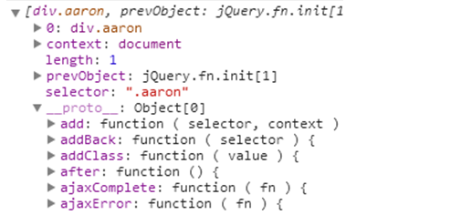

# 第二天
* jQuery的类数组对象结构
	* 什么是类数组对象？
		jQuery入口统一的$,是通过传递参数的不同，实现了9种方法的重载：
        ```JavaScript
        jQuery([selector,[ontext]]);
        
        jQuery(element);
        
        jQuery(elemenArray);
        
        jQuery(object);
        
        jQuery(jQuery object);
        
        jQuery(html,[ownerDocument]);
        
        jQuery(html,[attributes]);
        
        jQuery();
        
        jQuery(callback)
        ```
        以上9种用法可以分为三大块：选择器、dom的处理、dom加载。为了方便这些操作，jQuery内部就采用“*类数组对象* ”的方式作为存储结构，这样我们就能用如：push、pop、shift、each、map等类数组的方法操作jQuery对象了.
    * jQuery对象的可用数组下标索引原理：
    	通过``` $(".class") ```构建的对象结构如下:
        
    	
        
        简单的模拟代码：
		```JavaScript
        var aQuery=function(selector){
        	if(!(this instanceof aQuery)){
            	return new aQuery(selector);
        	}
            var elem=document.getElementById(/[^#].*/.exec(selector)[0]);
            this.length=1;
            this[0]=elem;
            this.context=document;
            this.selector=selector;
            this.get=function(num){
            return this[num];
            
            }
            return this;
        
        }
        ```
